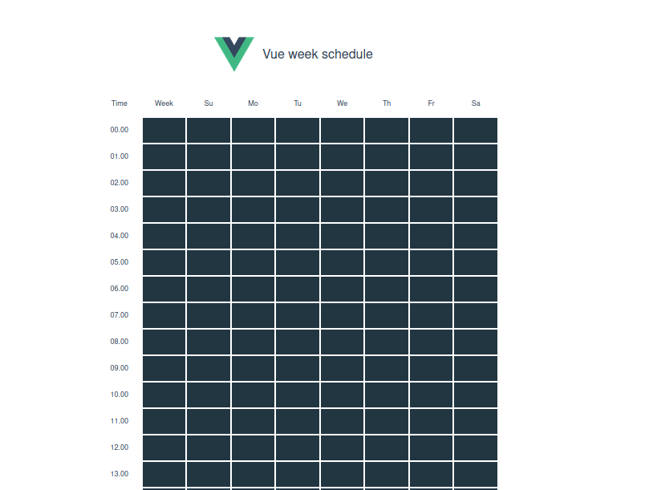

# vue daily scheduler

<div align='center'>

[](.)

Vue daily scheduler is a custom Vue2 component to manage repeated schedule. It's a straightforward scheduler component you can use.

</div>

### Demo

[Demo here](https://vue-daily-schedule.vercel.app/)

### Install
Node
```
npm install vue-daily-scheduler

# or yarn

yarn add vue-daily-scheduler
```
Browser
```html
<link href="https://unpkg.com/vue-daily-scheduler@latest/dist/vue-schedule.min.css" ref="stylesheet" />
<script src="https://unpkg.com/vue-daily-scheduler@latest/dist/vue-schedule.min.js"></script>
```

then, use inside a component
```javascript
import 'vue-daily-scheduler/dist/vue-schedule.min.css'
import VueSchedule from 'vue-daily-scheduler'
export default {
    components: {
        VueSchedule
    },
    data () {
        return {
            schedule: {
                0: [],
                1: [],
                2: [],
                3: [],
                4: [],
                5: [],
                6: []
            }
        }
    }
}
```
use it inside vue template
```html
<template>
    <div>
        <VueSchedule v-model="schedule" />
    </div>
</template>
```

### Props
|Props|Desc|Type|Default|
|---|---|---|---|
|`steps`|The interval in minutes|`Number`|`60`|
|`dayTable`|Array of day names for changing order or i18n|`Array`|`['So','Mo','Tu','We','Th','Fr','Sa']`|
|`strWeek`|String for i18n support|`String`|`Week`|
|`strTime`|String for i18n support|`String`|`Time`|
|`bg`|Block scheduler background color|`String`|`#223642`|
|`bgHover`|Block scheduler background color when on hover|`String`|`#84dafc7a`|
|`bgActive`|Block scheduler background color when active|`String`|`#84c9fc`|
|`textColor`|Text color inside block scheduler|`String`|`#000`|
#### Example
```html
<template>
    <div>
        <VueSchedule 
            v-model="schedule" 
            bg="red"
            bgHover="gray"
            bgActive="black"
            textColor="#fff"
        />
    </div>
</template>
```

### Contribution
Feel free if you want to submit pull request or an issue.

##### Creators
|Name|
|---|
|[Burhanuddin Ahmed](https://github.com/burhanahmeed/)|
|[Oleg Zernov](https://github.com/sawyer3273)|

#### Thanks for help
|Name|
|---|
|[lan1hotspots](https://github.com/lan1hotspots)|

### License
 MIT
